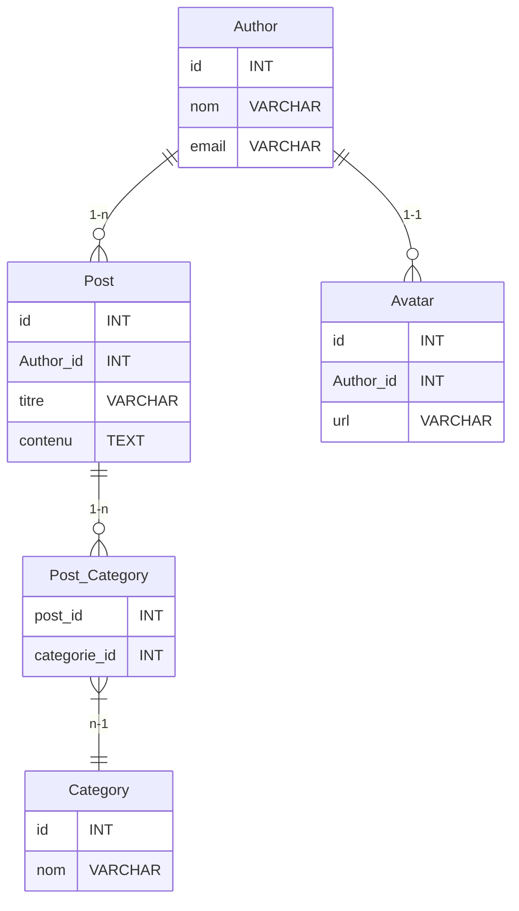

Je m'excuse pour cela. Voici la question manquante avec la réponse correcte cochée :

### QCM sur le Modèle Relationnel et les Contraintes d'Intégrité SQL

#### Modèles de données :
- **Author** : (id, nom, email)
- **Post** : (id, titre, contenu, author_id)
- **Category** : (id, nom)
- **Avatar** : (id, url, author_id)
- **Post_Category** : (post_id, categorie_id)

### Questions :

1. **Quelle contrainte d'intégrité est utilisée pour définir la relation entre `Author` et `Post` ?**

   - [ ] A. Foreign Key

**Commentaires:** La bonne réponse est A  
C'est une clé étrangère (Foreign Key) qui est  utilisée ici pour créer une relation entre les deux tables, assurant l'intégrité référentielle en liant la clé primaire d'une table parent à une colonne de la table enfant.

2. **Quelle relation existe entre `Author` et `Post` ?**

   - [ ] D. Plusieurs à un (one to many)

**Commentaires:** La bonne réponse est D
Un auteur peut avoir plusieurs posts (publication), mais chaque publication est associée à un seul auteur. C'est une relation plusieurs-à-un (one-to-many).

3. **Que signifie la contrainte `ON DELETE CASCADE` dans une relation `Foreign Key` ?**

   - [ ] A. Lorsqu'un enregistrement est supprimé, les enregistrements dépendants (table propriétaire) sont également supprimés.
   
**Commentaires:** La bonne réponse est A
La contrainte ON DELETE CASCADE signifie que lorsqu'on supprime un enregistrement parent ça entraîne automatiquement la suppression des enregistrements enfants qui sont liés.

4. **Quelle contrainte serait appropriée pour la relation `Post` et `Category` dans la table propriétaire ?**

   - [ ] A. Foreign Key

**Commentaires:** La bonne réponse est A
La relation entre Post et Category utilise une table de liaison (Post_Category). La clé étrangère dans la table de liaison va servir à maintenir l'intégrité référentielle entre ces deux tables.

5. **Dans une relation `many to many` entre `Post` et `Category`, quelle table intermédiaire est nécessaire ?**
  
   - [ ] C. Cat_Post
 
**Commentaires:** La bonne réponse est C
Un post peut appartenir à plusieurs catégories et en revanche une catégorie peut contenir plusieurs posts, ce qui définit une relation plusieurs-à-plusieurs.

6. **Quelle contrainte d'intégrité autre qu'une FK serait utilisée pour la relation un à un entre `Author` et `Avatar` dans la table propriétaire l'une ou l'autre dans ce cas ?**

   - [ ] B. Une deuxième Primary Key dans une des deux tables

**Commentaires:** La bonne réponse est B

7. **Quelle est la clé primaire, recommandée, dans la table `Post_Category` ?**

   - [ ] A. post_id

**Commentaires:** La bonne réponse est A
Chaque auteur a au plus un avatar et chaque avatar appartient à un seul auteur, ce qui définit une relation un-à-un.

8. **Que fait la contrainte `ON DELETE SET NULL` ?**

   - [ ] D. Empêche la suppression des enregistrements parents.

**Commentaires:** La bonne réponse est D
La contrainte ON DELETE SET NULL signifie que la suppression d'un enregistrement parent est empêchée 

9. **Quelle relation est correcte pour `Post` et `Category` dans notre projet ?**
  
   - [ ] C. Plusieurs à plusieurs (many to many)
 
**Commentaires:** La bonne réponse est C
Un post peut appartenir à plusieurs catégories et une catégorie peut contenir plusieurs posts, c'est une relation plusieurs-à-plusieurs.

10. **Dans la table `Post`, quel champ représente une clé étrangère ?**
  
    - [ ] D. author_id

**Commentaires:** La bonne réponse est D
author_id dans la table Post est une clé étrangère qui référence l'identifiant de la table Author.

11. **Si un `Author` est supprimé que se passe-t-il dans la table `Post` si il y a des références ?**
 

    - [ ] D. On ne peut pas supprimer un `Author` si il y a des références dans la table `Post`

**Commentaires:** La bonne réponse est D
Par défaut, si une clé étrangère empêche la suppression d'un enregistrement parent lorsque des enregistrements enfants y font référence, l'auteur ne pourra pas être supprimé.

12. **Quel type de relation nécessite une table d'association ?**
  
    - [ ] D. Aucun des choix

**Commentaires:** La bonne réponse est D
Une relation plusieurs-à-plusieurs va nécessiter une table d'association pour stocker les liens entre les deux tables.

13. **Que se passe-t-il si une contrainte `ON DELETE RESTRICT` est définie sur une clé étrangère ?**
   
    - [ ] C. La suppression de l'enregistrement parent est empêchée.

**Commentaires:** La bonne réponse est C
La contrainte ON DELETE RESTRICT  va empêcher la suppression d'un enregistrement parent dans le cas ou il est référencé par des enregistrements enfants.

14. **Dans la relation un à un entre `Author` et `Avatar`, comment s'assure-t-on que chaque `Author` a au plus un `Avatar` ?**

    - [ ] A. En utilisant une clé étrangère unique dans `Avatar`.
  

**Commentaires:** La bonne réponse est A 
Une clé étrangère unique dans la table Avatar garantit qu'un auteur ne peut avoir au plus qu'un avatar.